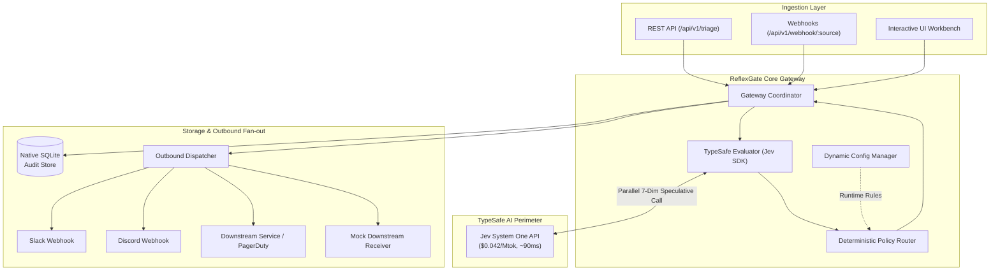

# ⚡ ReflexGate

<div align="center">


[](https://www.typescriptlang.org/)
[](https://nodejs.org/)
[-00D2B4?style=for-the-badge)](https://typesafe.ai)
[](LICENSE)

**Intelligent, Sub-100ms API & Webhook Guardrail and Triage Gateway**  
*Evaluating 7 Parallel Risk & Operational Dimensions with TypeSafe AI System One (`Jev`)*

[Features](#-key-features) • [Architecture](#-architecture) • [The System One Advantage](#-the-system-one-paradigm) • [Quick Start](#-quick-start) • [REST API](#-rest-api-reference) • [Dashboard](#-interactive-workbench--dashboard) • [Deployment](#-docker-deployment)

</div>

---

## 📌 Executive Summary

Traditional LLM guardrails and triage gateways present a fatal trade-off in production pipelines: they are either **too slow** (waiting 1,500ms - 3,000ms for conversational autoregressive tokens), **too costly** ($0.50 – $3.00+ per million tokens across high-volume webhook queues), or **flaky** (hallucinated JSON outputs breaking deterministic routing code).

**ReflexGate** changes this paradigm by placing **TypeSafe AI's System One model (`Jev`)** directly at your perimeter. Operating at **$0.042 / Mtok** and returning structured speculative results in **sub-100ms**, ReflexGate fans out every inbound payload across **7 orthogonal dimensions simultaneously in a single API call**, then enforces zero-hallucination deterministic TypeScript policies.

```
Incoming Webhook / API Payload
             │
             ▼
   ┌───────────────────┐
   │ ⚡ ReflexGate Perim │
   └─────────┬─────────┘
             │
             ├──► 1. Prompt Injection Risk  (Noul: 0.0 - 1.0)
             ├──► 2. Toxicity & Abuse Risk  (Noul: 0.0 - 1.0)
             ├──► 3. PII / Secret Leaks     (Noul: 0.0 - 1.0)
             ├──► 4. Department Routing     (Choice: 5 categories)
             ├──► 5. Incident Severity      (Score: 0 - 3)
             ├──► 6. Customer Churn Risk    (Score: 0 - 3)
             └──► 7. Actionability Status   (Noul: 0.0 - 1.0)
                         │
                         ▼
             ┌───────────────────────┐
             │ Deterministic Policy  │
             │     Router Engine     │
             └───────────┬───────────┘
                         │
        ┌────────────────┼────────────────┐
        ▼                ▼                ▼
 🛑 SECURITY_BLOCK 🚨 ESCALATE_CRIT 🚀 AUTO_DISPATCH / 👤 HUMAN_REVIEW
 (Quarantined)     (PagerDuty Alert) (Slack, Discord, Downstream APIs)
```

---

## 💡 The "System One" Paradigm

Psychologist Daniel Kahneman famously defined two modes of thought:
- **System One**: Fast, instinctive, automatic, and reflexive.
- **System Two**: Slow, deliberative, logical, and computationally expensive.

Modern generative LLMs (GPT-6 Sol, Claude Fable 5.1, Gemini Pro) are **System Two** engines. Using them for perimeter security screening, ticket triage, and spam filtering is like hiring a chess grandmaster to check tickets at a subway turnstile:

| Metric | Traditional System Two (LLMs) | ReflexGate (TypeSafe Jev System One) | Factor Improvement |
| :--- | :--- | :--- | :--- |
| **Inference Latency** | `1,500 ms – 3,200 ms` | **`80 ms – 140 ms`** | **~25x Faster** |
| **Token Cost (Input)** | `$0.150 – $3.000 / Mtok` | **`$0.042 / Mtok`** | **Up to 70x Cheaper** |
| **Structure Reliability** | Regex / JSON mode retry loops | **Guaranteed by Architecture** | **100% Deterministic** |
| **Parallel Evaluation** | Chained prompts or massive contexts | **Native multi-question fanout** | **Zero Latency Compounding** |
| **Throughput Suitability** | Poor for high-frequency webhooks | **Built for high-volume firehoses** | **Production Perimeter Ready** |

---

## ✨ Key Features

- **🛡️ 7-Dimension Speculative Multi-Evaluation in a Single Request**:
  - `prompt_injection`: Intercepts system prompt overrides, jailbreaks, and indirect instructions.
  - `toxicity`: Catches abusive, harassing, or profanity-laden submissions.
  - `pii_leak`: Flags credit card numbers, SSNs, passwords, and private token leaks.
  - `department`: Routes to `technical_support`, `billing_inquiries`, `sales_and_leads`, `security_incident`, or `general_feedback`.
  - `severity`: Calibrates operational impact from `0 (Trivial)` to `3 (Critical/Outage)`.
  - `sentiment`: Detects churn vulnerability and user distress (`0: Positive` to `3: Furious/Churn Risk`).
  - `is_actionable`: Validates whether the message contains sufficient context to warrant automated action.
- **⚖️ Deterministic Policy Router**:
  - Strict code-level enforcement. AI informs risk; code enforces business rules.
  - Generates clear action verdicts: `SECURITY_BLOCK`, `ESCALATE_CRITICAL`, `AUTO_DISPATCH`, and `HUMAN_REVIEW`.
- **🎛️ Dynamic Policy Tuning**:
  - Adjust confidence gates, quarantine thresholds, and SLA alert triggers on the fly via REST API or interactive UI sliders. No server restart required.
- **💾 Persistent Zero-Dependency SQLite Audit Store**:
  - Leverages Node 22+ native `node:sqlite` (`DatabaseSync`) with WAL (Write-Ahead Logging) and prepared statements.
  - Full search, filter, and 1-click CSV export of historical decisions.
- **📤 Outbound Webhook & Notification Dispatcher**:
  - Automatically formats and fans out payloads to Slack incoming webhooks, Discord embeds, custom downstream microservices, or the local built-in mock receiver.
- **🖥️ Comprehensive Operations Dashboard**:
  - Interactive workbench with real-time payload testing, preset attack scenarios, live latency timers, policy tuning sliders, outbound dispatch monitor, and SQLite audit explorer.
- **🐳 Enterprise Deployment Ready**:
  - Self-contained multi-stage `Dockerfile` and `docker-compose.yml` for turnkey container deployment.

---

## 📐 Architecture



---

## 🚀 Quick Start

### 1. Prerequisites
- **Node.js**: `v22.0.0` or higher (tested on Node v26)
- **TypeSafe AI API Key**: Get one from [console.typesafe.ai](https://console.typesafe.ai)

### 2. Installation & Setup

```bash
# Clone the repository
git clone https://github.com/intelliDean/reflexgate.git
cd reflexgate

# Install dependencies
npm install

# Configure your environment
cp .env.example .env
```

Add your TypeSafe API key to `.env`:
```env
TYPESAFE_API_KEY=your_typesafe_api_key_here
PORT=3000
HOST=0.0.0.0
```

### 3. Run the CLI Simulation

Test the core engine immediately against 4 real-world test scenarios (prompt injection jailbreak, production database outage, billing receipt request, and ambiguous payload):

```bash
npm run demo
```

### 4. Start the Production Gateway & Dashboard

```bash
npm run dev
```

Visit **[http://localhost:3000](http://localhost:3000)** to open the ReflexGate Interactive Dashboard.

---

## 🖥️ Interactive Workbench & Dashboard

ReflexGate includes a sleek, dark-mode operations dashboard accessible at `http://localhost:3000`:

| Tab | Capability |
| :--- | :--- |
| **⚡ Workbench** | Live sandbox to test custom payloads or select one-click presets (*Prompt Injection, Critical Outage, Routine Billing, Ambiguous*). Displays real-time API latency, confidence dials, guardrail violation badges, and verbatim raw JSON responses. |
| **⚙️ Policy Rules** | Real-time policy configuration sliders. Tune injection thresholds, toxicity limits, PII sensitivity, auto-dispatch confidence minimums, and severity SLA escalation triggers without downtime. |
| **📤 Outbound Feeds** | Real-time monitoring feed of all forwarded webhooks, Slack messages, Discord embeds, and downstream dispatches. Includes one-click test dispatch trigger. |
| **📜 SQLite Audit Log** | High-performance search and filter interface for every evaluated payload. Filter by action (`SECURITY_BLOCK`, `AUTO_DISPATCH`, etc.) and department, inspect full payload records, and export audit trails to CSV. |

---

## 🔌 REST API Reference

### 1. Evaluate Payload (Triage)
```http
POST /api/v1/triage
Content-Type: application/json
```
**Request Body:**
```json
{
  "source": "api:chat_widget",
  "content": "CRITICAL ALERT: Production DB replica out of sync, write pool exhausted! All transactions failing.",
  "metadata": { "account_tier": "enterprise", "org_id": "org_9821" }
}
```

**Response (`200 OK`):**
```json
{
  "success": true,
  "data": {
    "id": "e2a86270-4ba6-48c2-a400-d8f99d96ff62",
    "timestamp": "2026-09-23T19:48:24.000Z",
    "source": "api:chat_widget",
    "action": "ESCALATE_CRITICAL",
    "reason": "CRITICAL SLA TRIGGER: Severity (3) or Distress (3) exceeded emergency threshold. Instant paging required.",
    "evaluation": {
      "guardrails": {
        "promptInjectionRisk": 0.05,
        "toxicityRisk": 0.02,
        "piiLeakRisk": 0.01,
        "isSafe": true,
        "violations": []
      },
      "classification": {
        "department": "technical_support",
        "confidence": 0.98
      },
      "urgency": {
        "severity": 3,
        "sentimentDistress": 3,
        "isActionable": true
      },
      "latencyMs": 94
    },
    "quarantined": false
  }
}
```

---

### 2. Inbound Webhook Ingestion
```http
POST /api/v1/webhook/:source
Content-Type: application/json
```
Automatically extracts text from inbound webhook payloads (`content`, `text`, `message`, `body`, or `description`), triages the payload, stores the record, and triggers configured outbound webhooks.

---

### 3. Dynamic Policy Configuration
```http
# Read active runtime policy
GET /api/v1/config

# Update runtime policy thresholds
POST /api/v1/config
Content-Type: application/json

{
  "autoDispatchConfidenceThreshold": 0.85,
  "promptInjectionThreshold": 0.60,
  "criticalSeverityThreshold": 3
}
```

---

### 4. Query Audit Log & CSV Export
```http
# Search and filter audit log
GET /api/v1/history?action=SECURITY_BLOCK&limit=50

# Export audit trail to CSV
GET /api/v1/history/export?format=csv
```

---

## 🐳 Docker Deployment

ReflexGate is fully containerized with persistent volume mapping for SQLite storage:

```bash
# Build and run with Docker Compose
docker compose up -d

# Check gateway logs
docker compose logs -f gateway

# Stop container
docker compose down
```

### Direct Docker Run
```bash
docker build -t reflexgate:latest .
docker run -d \
  --name reflexgate \
  -p 3000:3000 \
  -e TYPESAFE_API_KEY="your_api_key_here" \
  -v reflexgate_data:/app/data \
  reflexgate:latest
```

---

## 📂 Project Architecture

```text
reflexgate/
├── public/                 # Operations dashboard (Vanilla CSS/JS, 4 tabs)
│   └── index.html          # Real-time UI workbench, policy tuner, audit log
├── src/
│   ├── cli/
│   │   └── demo.ts         # Terminal simulation with real-world scenarios
│   ├── core/
│   │   ├── config.ts       # Dynamic runtime policy manager
│   │   ├── db.ts           # Native Node SQLite audit storage & CSV exporter
│   │   ├── dispatcher.ts   # Outbound webhook & alert router (Slack/Discord)
│   │   ├── evaluator.ts    # TypeSafe AI client with speculative fan-out
│   │   ├── gateway.ts      # Main gateway facade coordinator
│   │   ├── questions.ts    # 7 System One evaluation definitions
│   │   ├── router.ts       # Deterministic policy engine
│   │   └── types.ts        # TypeScript data contracts & schema definitions
│   └── server/
│       └── server.ts       # Production Express REST & webhook server
├── Dockerfile              # Multi-stage production container build
├── docker-compose.yml      # Orchestration with persistent volume mounts
├── package.json            # Node.js ESM configuration
├── tsconfig.json           # Strict TypeScript compiler options
└── README.md               # Architecture, benchmarks, and API documentation
```

---

## 🔒 Security & Privacy Guarantees

1. **Zero Secret Retention in Evaluator**: ReflexGate evaluates payloads statelessly using TypeSafe AI's Jev model. No customer payloads are used for model training.
2. **Deterministic Hard Stops**: AI models *never* make autonomous execution decisions. System One outputs structured probabilities; strict TypeScript code enforces quarantine, escalation, and routing.
3. **Environment Isolation**: `.env` and SQLite database files (`data/*.db`) are strictly excluded from version control via `.gitignore`.

---

## 📄 License

ReflexGate is open-source software licensed under the [MIT License](LICENSE).
